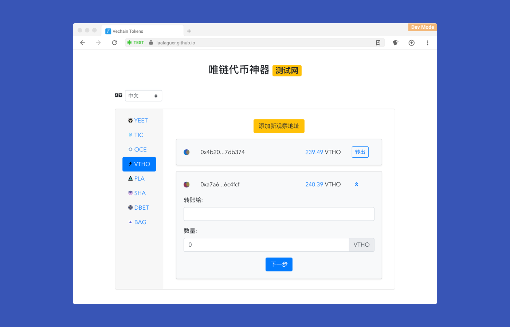

# VeChain Tokens

## Demo
[https://vechaintokens.abyteahead.com/](https://vechaintokens.abyteahead.com/)



## Token Viewer/Transfer on Sync
1. Runs in [VeChain-Sync-Browser](https://github.com/vechain/thor-sync.electron)
2. Depends on web page environment [Connex](https://github.com/vechain/connex)

## Project setup
```
npm install
```

### Compiles and hot-reloads for development
```
npm run serve
```

### Compiles and minifies for production
```
npm run build
```

### Run your tests
```
npm run test
```

### Lints and fixes files
```
npm run lint
```

### Prepare for publish
```
npm run publish
```

### Customize configuration
See [Configuration Reference](https://cli.vuejs.org/config/).

